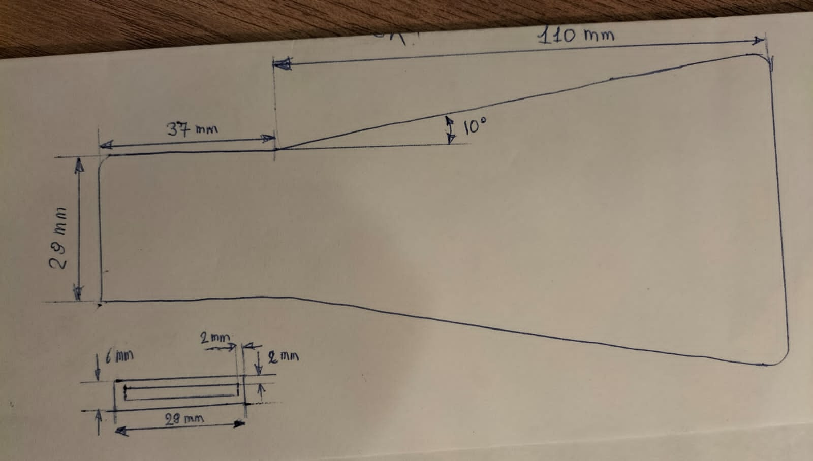

# Plano

Faz a redução de mecanismo utilizando a velocidade de chama laminar, utilizando tolerancia proxima ao estimativa de erro do metodo experimental usado.

* Grafico da evolução do erro estimado do mecanismo reduzido em função do numero de especies.
  * Posso plotar um eixo opcional da velocidade em função do numero de especies.

Gera os graficos comparando os resultados do mecanismo completo com o mecanismo reduzido, e se possivel, com dados experimentais.

Parametros a comparar entre o mecanismo completo e o reduzido:

* Variando fração de massa de combustível (e Phi)
  * Velocidade de chama laminar
  * Posição da frente de chama
  * Temperatura de chama adiabatica
  * Temperatura maxima na chama
  * Tempo de atraso de ignição
  * Temperatura de autoignição (??)
  * região de flamabilidade

4.1 A Fronteira de Saída (Outlet): A Criticidade do waveTransmissiveA saída é a fronteira mais sensível. O uso de zeroGradient ou fixedValue para pressão em escoamentos subsônicos compressíveis com combustão é incorreto e levará à divergência ou resultados não físicos.Recomendação: Utilizar waveTransmissive para o campo de pressão ($p$).

8.1 Extração de Dados no ParaViewIdentificação da Frente de Chama: Utilize o filtro Threshold para isolar células com temperatura intermédia (ex: 1500K) ou alta taxa de liberação de calor (Qdot). A presença do radical hidroxila ($OH$) também é um excelente marcador da zona de reação.Plotagem Axial: Utilize o filtro Plot Over Line ao longo do eixo central do canal (simetria).Cálculo de $S_L$: Plote a magnitude da velocidade ($U$) e Temperatura ($T$). A velocidade de chama laminar $S_L$ corresponde à velocidade do fluido na zona "fria" (reagentes) imediatamente antes do aumento abrupto de temperatura (zona de pré-aquecimento).Insight: No canal divergente, devido à desaceleração do fluxo, deve-se tomar a velocidade no ponto de inflexão térmico ou logo a montante dele, assumindo que a chama está estacionária no referencial do laboratório.